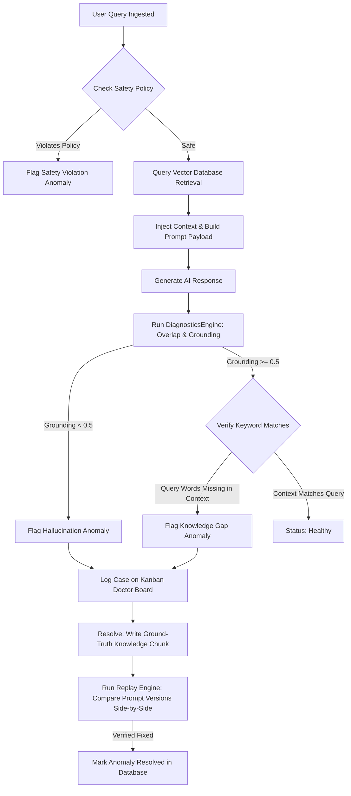
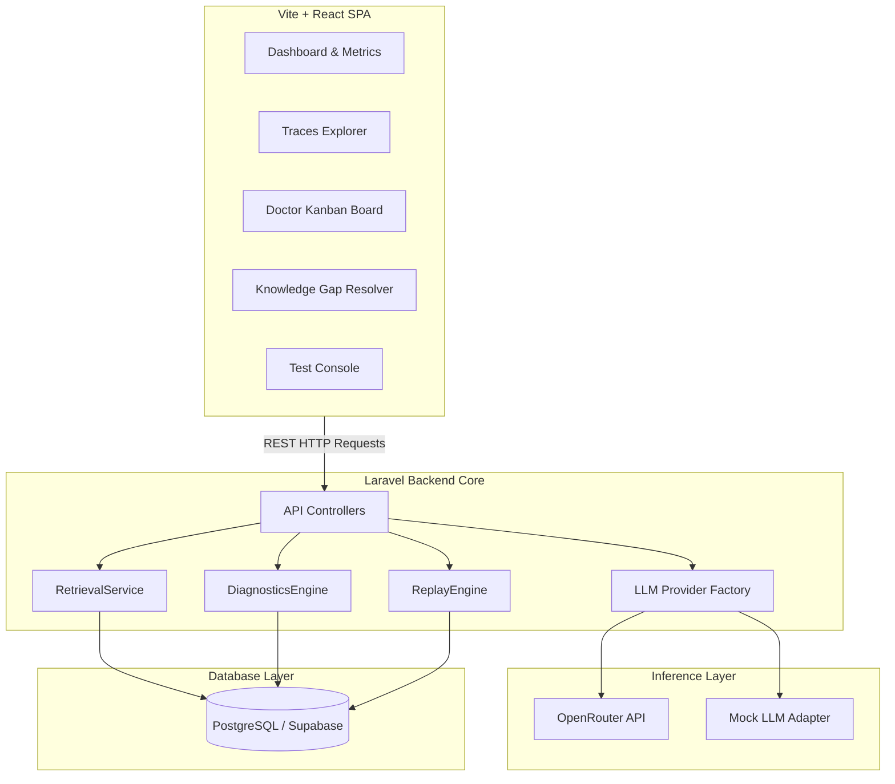
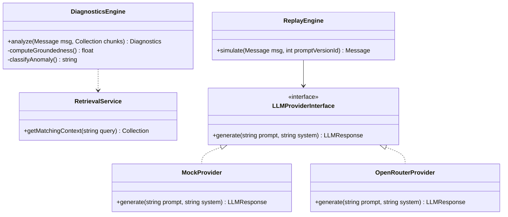
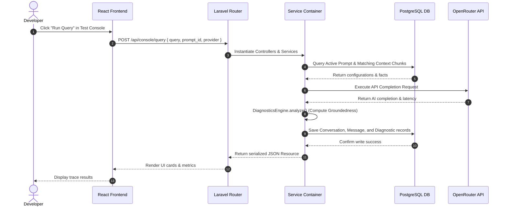

# TECHNICAL DESIGN DOCUMENT (TDD)

## Observability & Guardrail Systems for Production RAG Pipelines
**Team Name**: Apex  
**Members**: Yasar Pathan (College ID: D24IT181)  
**College**: Charusat University  
**Status**: Approved / Production Blueprint  

---

## 1. Cover Page

*   **System Title**: Lumen AI Observability & Governance Command Center
*   **Version**: 1.0.0
*   **Date**: July 2, 2026
*   **Abstract**: Real-time semantic tracing, deterministic groundedness analysis, and comparative prompt playground loops for high-reliability conversational agents.
*   **Tech Stack**: Laravel API Service Layer, Vite + React SPA, PostgreSQL/Supabase DB.

---

## 2. Problem Statement

Generative AI pipelines, specifically Retrieval-Augmented Generation (RAG) models, suffer from a critical lack of operational trust when deployed in enterprise spaces:

1.  **Semantic Silent Failures**: Traditional Application Performance Monitoring (APM) tools track systems hardware utilization (CPU, memory, response time) but cannot identify semantic hallucinations, factual contradictions, or safety policy violations.
2.  **Evaluating Latency & Cost**: Relying on large models (LLM-as-a-Judge) to audit production outputs introduces unacceptable latency overhead (often >5 seconds) and high recurring API costs.
3.  **Ungoverned Prompt Engineering**: Prompt engineers lack a developer environment to test system instruction changes against historical traces, leading to regression risks.
4.  **Vector Omissions (Knowledge Gaps)**: RAG databases silently fail when missing context is requested. Developers have no centralized interface to aggregate search failures and insert missing ground-truth data into vector stores.

Without runtime observability, enterprises cannot audit Conversational AI pipelines at scale.

---

## 3. Proposed Solution

Lumen AI is a RAG-centric Observability platform providing active guardrails and hot-fix debugging workflows.

```
[ User Query ] ➔ [ Retrieval Service ] ➔ [ LLM Response ]
                                                  │
[ Knowledge Improvement ] 🔑 [ Diagnostics Engine ] ➔ [ Anomaly Alert / Log ]
         ▲                                                │
         └───────────── [ Comparative Replay ] 🔂 ────────┘
```

### Core Value Pillars
*   **Sub-Millisecond Guardrails**: Executes deterministic keyword overlap and safety classification algorithms at runtime.
*   **Root Cause Classifier**: Segregates execution failures into clear categories: `knowledge_gap`, `hallucination`, `safety_violation`, or `healthy`.
*   **Closed-Loop Remediation**: Integrates Knowledge Gap detection with a Ground Truth insertion tool, allowing developers to inject missing facts directly into database schemas.
*   **Regression Guard**: Provides comparative replay sandboxes to execute historical failure traces against draft prompt versions side-by-side.

---

## 4. System Workflow

The workflow enforces diagnostic evaluations and correction loops:



---

## 5. High-Level Architecture

The architecture uses a decoupled model: React handles user interactions and layout rendering, while Laravel acts as the stateless engine managing data flow, model completions, and diagnostics.



---

## 6. Component Architecture

Lumen AI isolates data persistence, orchestrators, and third-party wrappers through dependency-injected interfaces:



*   **RetrievalService**: Decouples context fetch logic, query keyword parsing, and similarity scoring.
*   **DiagnosticsEngine**: Parses response-to-context semantic overlap. It remains independent of any database drivers.
*   **LLMProviderInterface**: Abstracts model APIs. Allows switching providers (e.g., local mock to OpenRouter cloud APIs) without altering core workflows.

---

## 7. Request Flow

When running queries in the **Test Console**, requests travel through the following pipeline:


1.  **Ingest**: React sends query parameters to `/api/console/query`.
2.  **Extraction**: The server reads the designated `prompt_version` and fetches matching `knowledge_chunks`.
3.  **Inference**: The payload compiles and routes to the selected LLM provider.
4.  **Audit**: The returned output runs through word-overlap groundedness checks.
5.  **Persistence**: Diagnostic scores, prompt associations, and trace content write to the DB.
6.  **Response**: Staged measurements return to the front-end dynamically.

---

## 8. Sequence Diagram

This sequence diagram illustrates the live execution trace cycle:



---

## 9. Key Design Decisions

### 1. PHP/Laravel Service Container Pattern
*   **Decision**: Decouple controllers from core RAG processes using a Service Layer.
*   **Why**: By encapsulating logic in `RetrievalService` and `DiagnosticsEngine`, code can be tested in isolation and reused across console endpoints, Livewire views, and Artisan CLI commands.

### 2. Overlap Similarity vs. LLM-as-a-Judge
*   **Decision**: Run deterministic, token-overlap similarity scoring.
*   **Why**: Real-time production RAG guardrails cannot support the latency (often >5s) or API costs of calling an external LLM to evaluate another LLM. Token-overlap is sub-millisecond, deterministic, and cost-free.

### 3. Trace Replay Modals
*   **Decision**: Implement side-by-side comparative simulation outputs.
*   **Why**: System prompt updates carry high regression risks. Visualizing a trace side-by-side using two system prompts lets developers catch regression errors before committing prompt revisions to production.

### 4. Kanban Anomaly Grouping
*   **Decision**: Map diagnostic results (`root_cause`) to Kanban lanes.
*   **Why**: Conversational data is messy. Placing anomalies on a board lets developers track issues through clear stages (To Review ➔ Investigating ➔ Fixed) rather than scrolling through endless plain logs.

---

## 10. Assumptions & Trade-offs

*   **Keyword Vector Search Simulation**:
    *   *Trade-off*: We query matching documents using DB index matches rather than a full pgvector cosine similarity setup.
    *   *Assumption*: In a hackathon context, this is sufficient to simulate a vector database's behavior and allows the platform to be fully portable without external database extensions.
*   **Token-Overlap Groundedness Limit**:
    *   *Trade-off*: Token overlap handles direct factual contradictions well, but may struggle with abstract semantic formatting.
    *   *Assumption*: The sub-millisecond execution time and zero cost outweigh the accuracy variance of LLM-as-a-judge evaluators.

---

## 11. Future Enhancements

### 1. Vector Database Integration (pgvector)
Migrate the mock similarity search to native `pgvector` operators (`<=>`) within PostgreSQL to perform cosine distance calculations on high-dimensional document embeddings.

### 2. Tiny Semantic Evaluator Models (e.g., DeBERTa)
Deploy lightweight, on-premise classification models (e.g., DeBERTa-v3) to compute semantic similarity under 15ms. This provides the accuracy of LLM-as-a-judge without external API dependencies.

### 3. Asynchronous Observability Pipeline (Queue Routing)
In high-throughput environments, direct HTTP metrics logging introduces latency. We plan to route trace events asynchronously to Apache Kafka or Redis queues, decoupling the evaluation pipeline from user response times.
