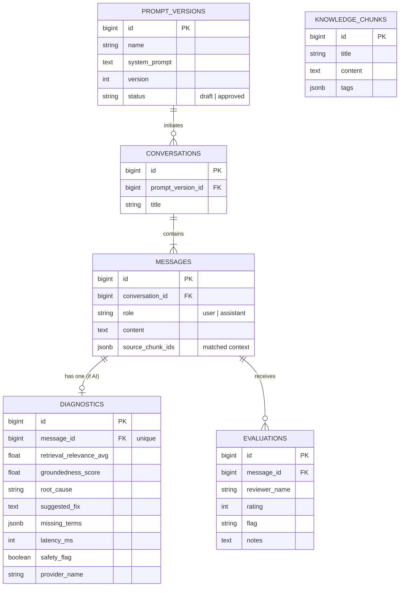

# Lumen AI - Database Design Documentation

This document outlines the relational database schema supporting the Lumen AI Observability platform. The architecture tracks conversations, RAG (Retrieval-Augmented Generation) context, automated diagnostic evaluations, and manual human reviews.

---

## Entity Relationship Diagram (ERD)

The core structure links `Conversations` and `Messages` to the actual `Prompt Versions` used during execution. `Diagnostics` and `Evaluations` are mapped 1:1 and 1:N to AI messages to track system health and human feedback, respectively. `Knowledge Chunks` operate independently as the vector ground truth.

---

## Schema Dictionary

### 1. `knowledge_chunks`
Stores the ground-truth factual documents used by the Retrieval-Augmented Generation (RAG) system to answer user queries.

| Column | Type | Constraints | Description |
| :--- | :--- | :--- | :--- |
| `id` | BigInt | Primary Key, Auto-increment | Unique identifier. |
| `title` | String | Required | The title or topic of the factual chunk. |
| `content` | Text | Required | The raw informational content/document text. |
| `tags` | JSONB | Nullable | Array of tags for domain-filtering (e.g. `["policy", "refund"]`). |
| `created_at` | Timestamp | | Record creation time. |
| `updated_at` | Timestamp | | Record update time. |

### 2. `prompt_versions`
Manages system instruction versioning. This enables the "Comparative Replay" feature by storing previous and current LLM behavior rules.

| Column | Type | Constraints | Description |
| :--- | :--- | :--- | :--- |
| `id` | BigInt | Primary Key, Auto-increment | Unique identifier. |
| `name` | String | Required | Descriptive name of the prompt (e.g. "Support Agent v1"). |
| `system_prompt` | Text | Required | The actual raw system instructions passed to the LLM. |
| `version` | Integer | Required | Numeric version tracker. |
| `status` | String | Default: `draft` | Enum: `draft` or `approved`. |

### 3. `conversations`
The top-level container grouping a series of back-and-forth messages between a user and the AI.

| Column | Type | Constraints | Description |
| :--- | :--- | :--- | :--- |
| `id` | BigInt | Primary Key, Auto-increment | Unique identifier. |
| `prompt_version_id` | BigInt | Foreign Key (`prompt_versions`) | The system prompt active when this conversation started. |
| `title` | String | Nullable | Optional auto-generated chat title. |

### 4. `messages`
Individual dialogue turns (user prompts and assistant completions) within a conversation.

| Column | Type | Constraints | Description |
| :--- | :--- | :--- | :--- |
| `id` | BigInt | Primary Key, Auto-increment | Unique identifier. |
| `conversation_id` | BigInt | Foreign Key (`conversations`) | Links to the parent conversation. Cascades on delete. |
| `role` | String | Required | Enum: `user` or `assistant`. |
| `content` | Text | Required | The raw text payload of the message. |
| `source_chunk_ids` | JSONB | Nullable | Array of `knowledge_chunks` IDs retrieved for this turn. |

### 5. `diagnostics`
Stores automated observability and guardrail metrics generated *per AI response*.

| Column | Type | Constraints | Description |
| :--- | :--- | :--- | :--- |
| `id` | BigInt | Primary Key, Auto-increment | Unique identifier. |
| `message_id` | BigInt | Foreign Key (`messages`), Unique | 1:1 relationship to the assistant's message. |
| `retrieval_relevance_avg` | Float | Required | Semantic relevance score of fetched context. |
| `groundedness_score` | Float | Required | Score (0.0 to 1.0) indicating factual overlap with context. |
| `root_cause` | String | Required, Indexed | Enum: `healthy`, `knowledge_gap`, `hallucination`, etc. |
| `suggested_fix` | Text | Nullable | Automated suggestion for remedying the anomaly. |
| `missing_terms` | JSONB | Nullable | Keywords from user query missing in context. |
| `latency_ms` | Integer | Required | Total response generation time in milliseconds. |
| `safety_flag` | Boolean | Default: `false` | True if the response violated safety or toxicity rules. |
| `provider_name` | String | Required | Which LLM service served the request (e.g. `mock`, `openrouter`). |

### 6. `evaluations`
Stores manual ratings and notes left by human auditors (used for fine-tuning datasets and RLHF).

| Column | Type | Constraints | Description |
| :--- | :--- | :--- | :--- |
| `id` | BigInt | Primary Key, Auto-increment | Unique identifier. |
| `message_id` | BigInt | Foreign Key (`messages`) | 1:N relationship. A message can have multiple reviews. |
| `reviewer_name` | String | Nullable | Name of the human auditor. |
| `rating` | Integer | Nullable | Score from 1 to 5. |
| `flag` | String | Nullable | Categorical feedback (e.g. `good`, `hallucination`). |
| `notes` | Text | Nullable | Free-form review comments. |

---

## Key Indexing Strategy
To ensure query performance for the Traces Dashboard and Health Analytics:
*   `diagnostics.root_cause`: Indexed to quickly count health anomalies (e.g., aggregating total `knowledge_gap` cases).
*   `diagnostics.message_id`: Unique index enforcing a 1-to-1 strict relationship.
*   `messages.conversation_id`: Indexed to rapidly retrieve timeline histories.
