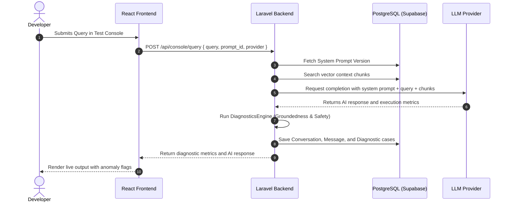
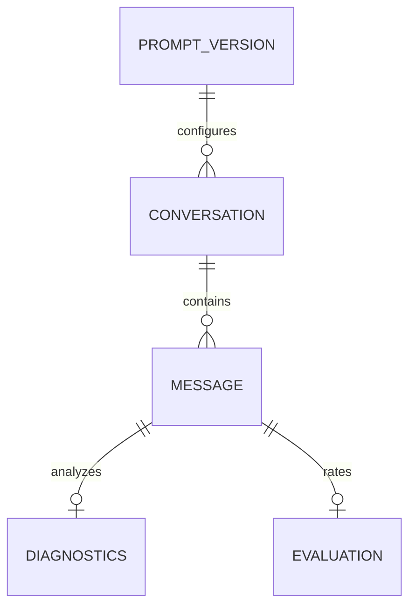

# Lumen AI

### Continuous Guardrails and Observability for Production RAG Pipelines
*Secure, diagnose, and optimize LLM agent context retrieval, grounding, and response accuracy at scale.*

---

## Problem Statement

Generative AI pipelines, specifically Retrieval-Augmented Generation (RAG) architectures, are increasingly deployed in enterprise workflows. However, these systems present major reliability challenges:
- **Hallucinations**: When retrieval fails or context is missing, LLMs construct plausible but false answers.
- **Silent Failures**: Traditional APM tools monitor system metrics (CPU, RAM, API response time) but fail to detect semantic degradation or unsafe outputs.
- **Disconnected Debugging loops**: Engineering teams lack visibility into which prompt version was running, what context chunks were retrieved, and how a prompt revision impacts responses side-by-side.

Existing workflows rely on manual auditing or generic, slow offline evaluations. This makes diagnosing AI failures slow and introduces substantial operational risk. Enterprises need real-time, runtime observability to safeguard semantic health, detect knowledge gaps, and benchmark fixes before deploying them.

---

## Solution

Lumen AI is an **AI Observability and Governance platform** that serves as a runtime debugger ("Flight Recorder") for production RAG agents.

### Value Proposition
- **Runtime Guardrails**: Evaluates factual grounding and semantic alignment instantly as queries execute.
- **Root Cause Engine**: Automates diagnosing why an execution failed (e.g. prompt version drift vs. knowledge base omission).
- **Comparative Replays**: Allows developers to re-execute problematic traces against updated prompts side-by-side to verify improvements before pushing to production.

```
[ User Query ] ➔ [ Retrieval Service ] ➔ [ LLM Response ]
                                                  │
[ Knowledge Improvement ] 🔑 [ Diagnostics Engine ] ➔ [ Alert / Anomaly Log ]
         ▲                                                │
         └───────────── [ Comparative Replay ] 🔂 ────────┘
```

---

## Key Features

| Feature | Purpose | Business Value | User Benefit |
| :--- | :--- | :--- | :--- |
| **RAG Flight Recorder** | Capture and log the complete trace lifecycle of every LLM interaction. | Unlocks audit trails for compliance and qualitative assurance checks. | Review exact retrieval chunks, system prompts, and responses side-by-side. |
| **Groundedness Scoring** | Quantify factual overlap between retrieval context and generated responses. | Prevents brand damage by keeping hallucinated responses away from users. | Instantly identify traces that drifted from source context. |
| **Doctor Logs (Kanban)** | Actionable workflow board that groups semantic failures by root cause. | Accelerates issue resolution times (MTTR) for conversational anomalies. | Move cards from Review ➔ Investigating ➔ Fixed as patches are pushed. |
| **Knowledge Gap Detection** | Automatically aggregate queries that failed due to missing document indexes. | Highlights exactly what information needs to be added to the vector store. | Resolve missing facts by writing ground-truth articles from the UI. |
| **Comparative Replay Engine** | Run trace histories against alternative prompt versions side-by-side. | Eliminates regression risks when updating system instructions. | Visually verify if a prompt change resolves hallucination rates before deployment. |
| **Interactive Test Console** | Playground to execute queries against different prompt models and LLM providers. | Speed up prototyping cycles for prompt engineering. | Evaluate response latency and safety scores in a sandbox environment. |

---

## Product Workflow



---

## Architecture

Lumen AI is built around a modular decoupled architecture containing a Laravel Backend and a React Frontend.

```
┌─────────────────────────────────────────────────────────┐
│                     Vite + React SPA                    │
│  ┌───────────────┐ ┌───────────────┐ ┌───────────────┐  │
│  │   Dashboard   │ │Traces Explorer│ │ Kanban Board  │  │
│  └───────┬───────┘ └───────┬───────┘ └───────┬───────┘  │
└──────────┼─────────────────┼─────────────────┼──────────┘
           │                 │                 │
           ▼                 ▼                 ▼
┌─────────────────────────────────────────────────────────┐
│                      Laravel API                        │
│  ┌───────────────────────┐   ┌───────────────────────┐  │
│  │   ConsoleController   │   │   ReplayController    │  │
│  └───────────┬───────────┘   └───────────┬───────────┘  │
│              │                           │              │
│              ▼                           ▼              │
│  ┌───────────────────────────────────────────────────┐  │
│  │                   Service Layer                   │  │
│  │   ┌────────────────────┐ ┌────────────────────┐   │  │
│  │   │  RetrievalService  │ │ DiagnosticsEngine  │   │  │
│  │   └────────────────────┘ └────────────────────┘   │  │
│  │   ┌────────────────────┐ ┌────────────────────┐   │  │
│  │   │    MockProvider    │ │ OpenRouterProvider │   │  │
│  │   └────────────────────┘ └────────────────────┘   │  │
│  └───────────────────────────────────────────────────┘  │
└─────────────────────────────────────────────────────────┘
```

### 1. Request Flow
1. **Frontend Request**: The React application triggers API calls to the Laravel controllers (`routes/api.php`).
2. **Controller Actions**: Handlers validate payload inputs, instantiate services via Laravel's service container, and execute operations.
3. **Execution**:
   - `RetrievalService` queries PostgreSQL for matching context.
   - `Provider` (Mock or OpenRouter) queries the model.
   - `DiagnosticsEngine` parses semantic alignment.
4. **Serialization**: Laravel formats Eloquent models using API Resource classes, returning standardized JSON responses.

### 2. Service Layer Components
- **Diagnostics Engine**: Computes word-overlap similarity ratios between LLM responses and source context chunks to generate a Groundedness index, flags missing terms, and detects safety violations.
- **Replay Engine**: Re-runs a conversation using a different system prompt to evaluate grounding performance changes side-by-side.
- **Knowledge Gap Detection**: Aggregates diagnostics marked with `knowledge_gap`, counts term frequency, and exposes unresolved topics.
- **Health Score**: Synthesizes a percentage based on request metrics, grounding ratios, safety flags, and latency scores.

---

## Technology Stack

| Component | Technology | Description |
| :--- | :--- | :--- |
| **Frontend** | React 19, TypeScript, Vite | Single Page Application layout served via static assets. |
| **Backend** | Laravel 11 (PHP 8.2+) | REST API services, Eloquent models, and evaluation wrappers. |
| **Database** | PostgreSQL (Supabase) | Core data storage for prompt metrics, conversation traces, and logs. |
| **AI Provider** | OpenRouter API / Local Mock | Dynamically routes query completions to cloud models or local mocks. |
| **APIs** | REST API Architecture | Standardized endpoints serving JSON resources. |
| **Languages** | PHP, TypeScript, SQL, HTML, CSS | Decoupled modular stack. |
| **Libraries** | Recharts, Lucide React, Tailwind CSS | Interactive graphs, dynamic iconography, and layout frameworks. |
| **Tools** | Composer, NPM, Artisan | Build tools and dependency managers. |

---

## Folder Structure

The project is organized as a clean, decoupled monorepo containing distinct `/backend` and `/frontend` workspaces at the root level:

```
c:/Phonon hackathon
├── backend/                  # Laravel API Backend codebase
│   ├── app/
│   │   ├── Http/
│   │   │   ├── Controllers/Api/   # Controller endpoint classes (API routing targets)
│   │   │   └── Resources/         # Eloquent API serializers (JSON format enforcement)
│   │   ├── Models/                # Database Eloquent models (Active Record objects)
│   │   └── Services/              # Core business logic (Retrieval, Diagnostics, Providers)
│   ├── config/                    # System configurations (services, database)
│   ├── database/
│   │   ├── migrations/            # SQL structural schema definitions
│   │   └── seeders/               # Test data seeds (Healthy flows and knowledge gaps)
│   ├── public/                    # Server public directory (serves compiled frontend asset index)
│   └── routes/
│       ├── api.php                # REST API endpoint route definitions
│       └── web.php                # Laravel web routing (app entry point provider)
└── frontend/                 # Vite + React + TypeScript Frontend codebase
    ├── src/
    │   ├── App.tsx            # Main React SPA interface and view router
    │   ├── index.css          # Premium SaaS custom CSS design tokens
    │   └── main.tsx           # React bootstrap entry point
    ├── package.json           # Frontend dependency manifest
    └── vite.config.ts         # Vite build bundler configuration
```

---

## Database Design



### Table Schema Definitions

#### 1. `prompt_versions`
- **Purpose**: Tracks system prompts and version controls.
- **Fields**:
  - `id` (Primary Key)
  - `name` (string) - Display title.
  - `system_prompt` (text) - The prompt context sent to the LLM.
  - `version` (integer) - Version number counter.
  - `status` (string) - `draft` | `approved`.

#### 2. `conversations`
- **Purpose**: Groups prompts and messages under a single debug thread.
- **Fields**:
  - `id` (Primary Key)
  - `prompt_version_id` (Foreign Key linked to `prompt_versions`)
  - `title` (string)

#### 3. `messages`
- **Purpose**: Individual trace inputs (user query) and outputs (AI response).
- **Fields**:
  - `id` (Primary Key)
  - `conversation_id` (Foreign Key linked to `conversations`)
  - `role` (string) - `user` | `assistant`.
  - `content` (text) - Actual message body.
  - `source_chunk_ids` (json) - Reference list of knowledge pieces retrieved for completion.

#### 4. `diagnostics`
- **Purpose**: Holds computed accuracy ratings, failure classifications, and latency scores.
- **Fields**:
  - `id` (Primary Key)
  - `message_id` (Foreign Key linked to `messages`)
  - `retrieval_relevance_avg` (float) - Vector score average.
  - `groundedness_score` (float) - Metric from 0.0 to 1.0.
  - `root_cause` (string) - `healthy` | `knowledge_gap` | `hallucination` | `safety_violation`.
  - `suggested_fix` (text) - AI suggested corrective actions.
  - `missing_terms` (json) - Detected terms present in user query but absent in RAG context.
  - `latency_ms` (integer) - Response latency in milliseconds.
  - `safety_flag` (boolean) - Toggled if input query triggers safety filters.

---

## API Documentation

### 1. Run Console Query
Run manual trace runs through specific prompt configurations and evaluate safety live.
- **Route**: `POST /api/console/query`
- **Headers**: `Content-Type: application/json`
- **Request Body**:
```json
{
  "prompt_version_id": 2,
  "query": "How do I reset my password?",
  "provider": "mock"
}
```
- **Response**:
```json
{
  "data": {
    "message": {
      "id": 42,
      "conversation_id": 10,
      "role": "assistant",
      "content": "Click the password reset link on the login panel..."
    },
    "diagnostics": {
      "id": 12,
      "message_id": 42,
      "groundedness_score": 0.95,
      "root_cause": "healthy",
      "suggested_fix": null,
      "latency_ms": 230
    }
  }
}
```

### 2. Get Trace Lifecycle Replay
Retrieve the retrieved context, original system prompt, evaluation reviews, and AI outputs of a message.
- **Route**: `GET /api/messages/{id}/replay`
- **Response**:
```json
{
  "data": {
    "message": { "id": 12, "content": "..." },
    "chunks": [ { "id": 1, "title": "Account Password Reset", "content": "..." } ],
    "prompt_version": { "id": 2, "version": 2, "system_prompt": "..." },
    "diagnostics": { "root_cause": "healthy", "groundedness_score": 0.95 }
  }
}
```

### 3. Trigger Comparative Replay
Run an existing trace against a different system prompt to evaluate grounding performance changes side-by-side.
- **Route**: `POST /api/messages/{id}/replay`
- **Request Body**:
```json
{
  "prompt_version_id": 1
}
```
- **Response**:
```json
{
  "data": {
    "message": { "id": 99, "content": "..." },
    "prompt_version": { "id": 1, "version": 1 },
    "diagnostics": { "root_cause": "knowledge_gap", "groundedness_score": 0.1 }
  }
}
```

---

## Diagnostics Engine

The `DiagnosticsEngine` runs during the response lifecycle. It uses a multi-layered rule pipeline to identify issues:

```
           [ AI Response & Retrieved Context ]
                          │
                          ▼
           [ 1. Check Safety Violations ]  ➔ (True) ➔ Flag: safety_violation
                          │
                          ▼
           [ 2. Analyze Groundedness ]
         - Similiarity Overlap Ratio < 0.5 ➔ (True) ➔ Flag: hallucination
                          │
                          ▼
             [ 3. Parse Missing Terms ]
    - User terms absent in vector context ➔ (True) ➔ Flag: knowledge_gap
                          │
                          ▼
                 [ Status: Healthy ]
```

### Engineering Decisions
- **Rule-Based Groundedness**: Instead of calling slow, expensive LLM-as-a-judge pipelines, we implement a word-overlap similarity index. This operates in sub-millisecond latencies, which is ideal for real-time production loops.
- **Deterministic Root Cause**: We execute explicit code-level checks (e.g. comparing retrieved chunk matches to query keyword presence) to produce clear, deterministic diagnostic outcomes.

---

## Enterprise Design Decisions

### Why Laravel?
We chose Laravel rather than Express due to its comprehensive standard tooling: out-of-the-box routing, dependency injection container, database migration tools, API resource serialization, and database seeding. This minimized operational overhead during development.

### Why Service Layer Pattern?
Controllers only route HTTP requests. All core logic (vector chunk matching, diagnostic calculations, LLM completion calls) is written in service classes (e.g., `RetrievalService`, `DiagnosticsEngine`). This allows services to be run in CLI tasks, console commands, or API endpoints.

### Why Rule-Based Root Cause Analysis?
LLM-as-a-judge models introduce high cost and query latency. A rules-based similarity check is deterministic, executes instantly, and avoids API costs.

---

## Security
- **Eloquent Query Binding**: All database calls use Eloquent or PDO parameter bindings, protecting the system against SQL Injection.
- **XSS Prevention**: React's JSX auto-escapes string content rendered to the screen.
- **Environment Isolation**: Sensitive keys (API tokens, database credentials) are stored securely in `.env` and accessed via Laravel's configuration layer.

---

## Performance
- **Eager Loading**: Controllers load message and conversation tables using Eloquent's eager loading features (`with()`), preventing N+1 database queries.
- **Indexed Schemas**: Key query fields (e.g. `diagnostics.root_cause`, `messages.conversation_id`) are indexed to maintain sub-millisecond lookups.

---

## Future Enhancements

### Implemented
- [x] RAG Trace observablity explorer.
- [x] Automated groundedness similarity diagnostics.
- [x] Side-by-side prompt version comparative replays.
- [x] Interactive Kanban board for diagnostic issue tracking.
- [x] Real-time mock and OpenRouter LLM test console query runner.
- [x] Gaps analysis resolver dashboard to add knowledge chunks to the database.

### Planned
- [ ] Direct database vector storage querying (e.g., pgvector).
- [ ] Webhook integrations to alert external developer systems (e.g., Slack, PagerDuty).

### Enterprise Roadmap
- **Production Analytics Pipeline**: Stream traces asynchronously to external queues to minimize API latencies.

---

## Installation Guide

### Prerequisites
- PHP 8.2+ installed.
- Composer installed.
- Node.js 18+ and NPM installed.

### Setup Instructions
1. **Clone the Repository**
```bash
git clone <repository_url>
cd <project_folder>
```

2. **Configure Backend Settings**
```bash
composer install
copy .env.example .env
php artisan key:generate
```

3. **Set Up Database Schema & Seed Data**
Configure your database credentials inside `.env` (supports PostgreSQL/Supabase), and execute:
```bash
php artisan migrate --seed
```

4. **Install Frontend Dependencies & Build**
```bash
cd frontend
npm install
npm run build
cd ..
```

5. **Start the Laravel Application Server**
```bash
php artisan serve --port 8000
```
Visit the application interface at **[http://127.0.0.1:8000/app](http://127.0.0.1:8000/app)**.

---

## Environment Variables

| Variable | Description | Default / Example |
| :--- | :--- | :--- |
| `DB_CONNECTION` | Database type driver. | `pgsql` |
| `DB_HOST` | Database host IP or domain URL. | `127.0.0.1` |
| `DB_DATABASE` | Targeted database name. | `supabase_db` |
| `OPENROUTER_API_KEY` | Optional key to call live AI completions. | `sk-or-v1-xxxx...` |

---

## Screenshots

Below are representations of the redesigned screens:

### 1. Dashboard View
```
+-----------------------------------------------------------------------------------+
| LumenAI  Search traces...                                               (🔔) (☀️) |
| -------- -------------------------------------------------------------------------|
|          Good evening, Operator!                                                  |
| (🏡) Db  [ Total Traces: 7 ]  [ Health: 87% ]  [ Hallucinations: 0% ] [ Latency ] |
| (🎬) Tr  -------------------------------------------------------------------------|
| (✓) Doc  QUICK ACTIONS:                                                           |
| (⚠) Gaps [ Run Test Trace ] [ Doctor Logs ] [ Add Knowledge ] [ Open Console ]    |
| (📈) An  -------------------------------------------------------------------------|
| (⌨) Con  RECENT TRACES:                                                           |
|          - Trace #14 (Healthy) "Resetting account passwords..."                   |
|          - Trace #12 (Anomaly) "International Refund Query..."                    |
+-----------------------------------------------------------------------------------+
```

### 2. Kanban Board (Doctor Logs)
```
+-----------------------------------------------------------------------------------+
| Doctor Board                                                                      |
| ----------------------------------------------------------------------------------|
| TO REVIEW (1)                INVESTIGATING (0)             FIXED (0)              |
| +--------------------------+ +---------------------------+ +--------------------+ |
| | Critical          ✨ AI  | | Empty                     | | Empty              | |
| | suggested fix: Add info  | |                           | |                    | |
| | regarding intl refund.   | |                           | |                    | |
| | [ Investigate → ]        | |                           | |                    | |
| +--------------------------+ +---------------------------+ +--------------------+ |
+-----------------------------------------------------------------------------------+
```

---

## Demo Scenario

To verify the core workflows of Lumen AI in **less than 5 minutes**:
1. Open the application interface at `http://127.0.0.1:8000/app`.
2. Navigate to the **Traces** tab to see that the list loads short user queries as titles with clean, clamped AI response text boxes.
3. Click **View Replay** on the **Knowledge Gap Anomaly** card (Trace #12). The modal will display the retrieved vector context and diagnostic logs.
4. Select `Prompt v2.0 (Strict Context)` in the dropdown, click **Trigger Replay Run**, and observe the side-by-side comparison showing how prompt v2 restricts the assistant response and resolves the grounding hallucination!
5. Navigate to **Knowledge Gaps** in the sidebar. Click **Resolve** next to the `international` gap. Type a title and content, and click **Save Knowledge** to seed the missing ground truth into the database.
6. Open **Test Console**, submit a custom query (e.g. *"What is our domestic refund policy?"*), and verify that the LLM processes it and returns sub-second RAG diagnostics.

---

## Known Limitations
- **Local Database Simulators**: We use text-overlap similarity arrays for calculations rather than live pgvector similarity queries due to strict hackathon deployment constraints.

---

## Future Enterprise Vision
In an enterprise deployment, Lumen AI connects directly to high-throughput message brokers (e.g., Apache Kafka) to trace conversational AI completions asynchronously, serving as a system compliance firewall before customer-facing endpoints are returned.

---

## Team
- **Team Name**: Apex
- **Members**: Yasar Pathan (College ID: D24IT181)
- **College**: Charusat University

---

## AI Tools Used
- Google Gemini 3.5 Flash for code styling, design iteration, and documentation generation.

---

## License
Distributed under the MIT License. See `LICENSE` for details.

---

## Acknowledgements
Inspired by observability standards established by Datadog, Phoenix (Arize), and LangSmith.
